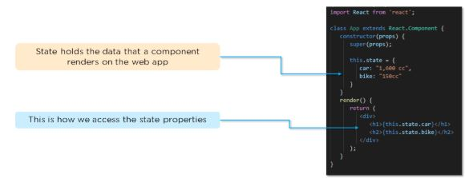

# Common Questions
1. What are the features of React?
   
   - **JSX**:  JSX is a syntax extension to JavaScript. It is used with React to describe what the user interface should look like. By using JSX, we can write HTML structures in the same file that contains JavaScript code.
   - **Components**: Components are the building blocks of any React application, and a single app usually consists of multiple components. It splits the user interface into independent, reusable parts that can be processed separately.
   - **Virtual DOM**: React keeps a lightweight representation of the real DOM in the memory, and that is known as the virtual DOM. When the state of an object changes, the virtual DOM changes only that object in the real DOM, rather than updating all the objects.
   - **One-way data-binding**: React’s one-way data binding keeps everything modular and fast. A unidirectional data flow means that when designing a React app, you often nest child components within parent components.
   - **High performance**: React updates only those components that have changed, rather than updating all the components at once. This results in much faster web applications.
  
2. What's the JSX?
   
   JSX is a syntax extension to JavaScript. It is used with React to describe what the user interface should look like. By using JSX, we can write HTML structures in the same file that contains JavaScript code.
   ``` js
   render(){
    return(
        <div>
            <h1> This is a JSX code </h1>
        </div>
    )
   }
   ``` 

3. Can web browsers read JSX directly?
   - Web browsers cannot read JSX directly. This is because they are built to only read regular JS objects and JSX is not a regular JavaScript object 
   - For a web browser to read a JSX file, the file needs to be transformed into a regular JavaScript object. For this, we use **Babel**
  
4. What's the virtual DOM?
   
   DOM stands for Document Object Model. The DOM represents an HTML document with a logical tree structure. Each branch of the tree ends in a node, and each node contains objects.

   React keeps a lightweight representation of the real DOM in the memory, and that is known as the virtual DOM. When the state of an object changes, the virtual DOM changes only that object in the real DOM, rather than updating all the objects. 

5. Why use React instead of other frameworks, like Angular?
   - **Easy creation of dynamic applications**: React makes it easier to create dynamic web applications because it provides less coding and provides more functionality, whereas, with JavaScript applications, code tends to get complex very quickly.
   - **Improved performance**: React uses virtual DOM, which makes web applications perform faster. Virtual DOM compares its previous state and updates only those components in the real DOM, whose states have changed, rather than updating all the components — like conventional web applications.
   - **Reusable components**: Components are the building blocks of any React application, and a single app usually consists of multiple components. These components have their own logic and controls, and they can be reused throughout the application, which, in turn, dramatically reduces the development time of an application.
   - **Unidirectional data flow**: React follows a unidirectional data flow. This means that when designing a React app, we often nest child components within parent components. And since the data flows in a single direction, it becomes easier to debug errors and know where the problem occurs in an application at the moment.
   - **Dedicated tools for easy debugging**: Facebook has released a Chrome extension that we can use to debug React applications. This makes the process of debugging React to web applications faster and easier.   

6. what's an event in React?
   An event is an action that a user or system may trigger, such as pressing a key, a mouse click, etc. React events are named using camelCase, rather than lowercase in HTML. With JSX, you pass a function as the event handler, rather than a string in HTML.

   ```js
   <Button onPress={lightItUp}/>
   ```   

7.  What're synthetic events in React?
   Synthetic events combine the response of different browsers' native events into one API, ensuring that the events are consistent across different browsers. The application is consistent regardless of the browser it is running in. Here, **preventDefault** is a synthetic event.

   ```js
   function ActionLink(){
    function handleClick(e){
        e.preventDefault();
        console.log('You just clicked a link');
    }
    return (
        <a href="#" onClick={handleClick}>
            Click Me
        </a>
    )
   }
   ```

8.  Explain how lists work in React.
   
   We create lists in React as we do in regular JavaScript. Lists display data in an ordered format. The traversal of lists is done using the map() function.

   ```js
   const names = ['Kohli', 'Saif', 'Arun', 'Aamir', 'Arif'];

   const listOfNames = () => {
    const listItems = names.map((name) => 
        <li key = {name}>
            {name}
        </li>
    );

    return(
        <ul>
            {listItems}
        </ul>
    )
   }
   ```

9.  Why's there a need for using keys in Lists?
    - A key is a unique identifier and it is used to identify which items have changed, been updated, or deleted from the lists
    - It also helps to determine which components need to be re-rendered instead of re-rendering all the components every time. Therefore, it increases performance, as only the updated components are re-rendered
  
10. What're forms in React?
    - Using forms, users can interact with the application and enter the required information whenever needed. The form contains certain elements, such as text fields, buttons, checkboxes, radio buttons, etc
    - Forms are used for many different tasks such as user authentication, searching, filtering, indexing, etc

11. How do you create forms in React?
    
    ```js
    class NameForm extends React.Component{
        this.state = {value: ''};

        handleChange(event){
            this.setState({value: event.target.value});
        }
        handleSubmit(event){
            alert('A name was entered:' + this.state.value);
            event.preventDefault();
        }

        render(){
            return(
                <form onSubmit={this.handleSubmit.bind(this)}>
                    <label>
                        Name;
                        <input type="text" value={this.state.value} onChange={this.handleChange.bind(this)}/>
                    </label>
                    <input type="submit" value="Submit"/>
                </form>
            )
        }
    }
    ```

12. What's an arrow function and how is it used in React?
    - An arrow function is a short way of writing a function to React.
    - It is unnecessary to bind ‘this’ inside the constructor when using an arrow function. This prevents bugs caused by the use of ‘this’ in React callbacks.
  
  

# Component Questions
1.  What're the components of React?
   - Components are the building blocks of any React application, and a single app usually consists of multiple components. A component is essentially a piece of the user interface. It splits the user interface into independent, reusable parts that can be processed separately.
   - There are two types of components in React:
     - **FunctionalComponents**: These types of components have no state of their own and only contain render methods, and therefore are also called **stateless components**. They may derive data from other components as props (properties).
        ```js
        function Greeting(props){
            return
                <h1>
                    Welcome to {props.name}
                </h1>
        }
        ```
     - **ClassComponents**: These types of components can hold and manage their own state and have a separate render method to return JSX on the screen. They are also called **Stateful components** as they can have a state.
        ```js
        class Greeting extends React.Component{
            render(){
                return
                    <h1>
                        Welcome to {this.props.name}
                    </h1>
            }
        }
        ```
2.  What's the use of render() in React?
   - It is required for each component to have a render() function. This function returns the HTML, which is to be displayed in the component.
   - If you need to render more than one element, all of the elements must be inside one parent tag, like <div>, <form>.

3.  What's a state in React?
   - The state is a built-in React object that is used to contain data or information about the component. The state of a component can change over time, and whenever it changes, the component re-renders.
   - The change in state can happen as a response to user action or system-generated events. It determines the behavior of the component and how it will render.
4.  How do you implement state in React?
   
    

5.  How do you update the state of a component?
   - We can update the state of a component by using the built-in ‘setState()’ method.set

    

6.  What're props in React?
   - Props are short for Properties. It is a React built-in object that stores the value of attributes of a tag and works similarly to HTML attributes.
   - Props provide a way to pass data from one component to another component. Props are passed to the component in the same way as arguments are passed in a function.

7.  How do you pass props between components?
8.  What're the differences between state and props?
   
   |      | State | Props |
   | :--- | :--- | :--- |
   | Use | Holds information about the components | Allows to pass data from one component to other components as an argument |
   | Mutability | Mutable | Immutable |
   | Child Components | Child components cannot access | Child component can access |
   | Stateless Components | Cannot have a sate | Can have props |
   
9.  What's a higher-order component in React?
- A higher-order component acts as a container for other components. This helps to keep components simple and enables re-usability. They are generally used when multiple components have to use a common logic. 
  
1.    What're the differences between class and functional components?

   |      | Class Components | Functional Components |
   | --- | --- | --- |
   | State | Can hold or manage state | Cannot hold or manage state |
   | Simplicity | Complex | Simple |
   | Lifecycle | Can work with all lifecycle methods | Doesn't work with any lifecycle method |

# Redux Questions
1. What's Redux?
   - Redux is an open-source, JavaScript library used to manage the application state. React uses Redux to build the user interface. It is a predictable state container for JavaScript applications and is used for the entire application’s state management.
2. What're the components of Redux?
   - **Store**: Holds the state of the application.
   - **Action**: The source information for the store.
   - **Reduce**: Specifies how the application's state changes in response to actions sent to the store.
  
  

3. What's the Flux?
   - Flux is the application architecture that Facebook uses for building web applications. It is a method of handling complex data inside a client-side application and manages how data flows in a React application.
   - There is a single source of data (the store) and triggering certain actions is the only way to update them. The actions call the dispatcher, and then the store is triggered and updated with their data accordingly.
   - When a dispatch has been triggered, and the store updates, it will emit a change event that the views can rerender accordingly.

    

4. How is Redux different from Flux?

| SN | Redux | Flux |
| --- | --- | --- |
| 1 | Open-Source library | Flux is an architecture, not a framework or library |
| 2 | Store's state is immutable | Store's state is mutable |
| 3 | Only single-store | Multiple Stores |
| 4 | Use concept of reducer | Use concept of dispatcher |

# Router Questions
1. What's React Router?
   - React Router is a routing library built on top of React, which is used to create routes in a React application.
2. Why do we need to React Router?
   - It maintains consistent structure and behavior and is used to develop single-page web applications.
   - Enables multiple views in a single application by defining multiple routes in the React application.
3. How is React routing different from conventional routing?
   
    | SN | React Routing | Conventional Routing |
    | --- | --- | ---|
    | 1 | Single HTML Page | Each view is a new HTML file |
    | 2 | The user navigates multiple views in the same file | The user navigates multiple files for each view |
    | 3 | The page doesn't refresh since it's a single file | The page refreshes every time user navigates |
    | 4 | Improved performance | Slower performance |

4. How do you implement React routing?

# Styling Questions
1. How do you style React components?
2. Explain the use of CSS modules in React.

# Terminology
**Props**: Props are used to pass data from a parent component to a child component. Props are immutable and cannot be changed within a component.
**State**: State is used to manage data within a component. State is mutable and can be updated using the setState function.

**Hooks**: Hooks are functions that let you “hook into” React state and lifecycle features from function components. Hooks don't work inside classes. (Which allow us to reuse the stateful logic between components)

# Comparasion

props vs state <br>
[var vs let vs const](https://www.freecodecamp.org/news/var-let-and-const-whats-the-difference/)
- var: variable which could be overwritten <br>
- const: variable which could not be overwritten <br>
[Rest Operator vs Spread Operator](https://www.freecodecamp.org/news/javascript-rest-vs-spread-operators/)